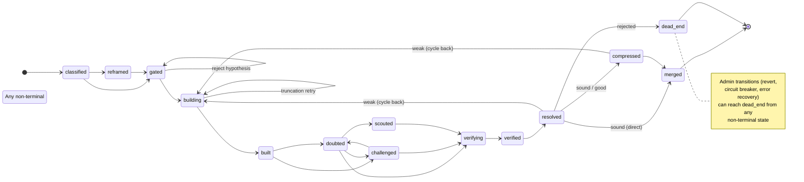

# Majlis

[](https://www.npmjs.com/package/majlis)

**Structured multi-agent problem solving through doubt, verification, and compressed knowledge.**

Standard AI coding agents are great at boilerplate, but terrible at novel engineering. They get stuck in loops, hallucinate fixes that break other things, forget context over time, and confidently optimise the wrong objectives.

Majlis wraps Claude Code in a deterministic state machine. It forces AI agents into a rigorous scientific method: classify the problem, hypothesise a solution, build it, systematically doubt it, independently verify it, and compress what was learned into durable knowledge. Before code is merged, it must survive challenge, verification, and regression gates.

**This is not for:** fixing syntax errors, standard API integration, boilerplate generation, or any problem where the answer is already known.

**This is for:** novel algorithm development, mathematical proof exploration, complex system design where failure modes are unknown, and any problem where being confidently wrong is more expensive than being slow.

## Quick Start

Majlis requires your project to have a deterministic test or metrics command. **Before scaffolding into an existing project**, have Claude read [READINESS.md](READINESS.md) — it's a step-by-step directive that walks through setting up a metrics command, identifying fixtures and gates, writing CLAUDE.md, and configuring tracked metrics.

New project:
```bash
npx create-majlis my-project && cd my-project
majlis status
```

Existing project (after running through READINESS.md):
```bash
npx create-majlis --init
majlis status    # check readiness — all green?
```

## The Developer Workflow

Majlis handles the management; you provide the direction.

**1. Declare your intent:**
```bash
majlis session start "Fixing the boundary collision bug"
```

**2. Propose a specific, testable hypothesis:**
```bash
majlis new "Use a bounding-box pre-filter to cull distant vertices" \
  --sub-type collision \
  --context docs/algorithms/spatial-hashing.md
```

**3. Let the Majlis debate:**
```bash
majlis next --auto
```

Behind the scenes, the framework runs a full cycle:

- A **Gatekeeper** checks the hypothesis against dead-ends and stale references
- A **Builder** writes the code and tags every decision with its evidence level
- An **Adversary** constructs pathological inputs designed to break the approach
- A **Critic** raises doubts backed by evidence
- A **Verifier** runs your project's test suite and grades each component

Then the system **resolves** deterministically:
- **Sound** — merge
- **Good** — merge, record gaps in the fragility map
- **Weak** — cycle back with synthesised guidance for the builder
- **Rejected** — dead-end it, record the structural constraint, revert

No LLM decides the routing. The state machine does, based on grades and metrics. If a gate fixture regressed, the merge is blocked regardless of how good the verification grades look.

If the **Gatekeeper** rejects a hypothesis, the experiment pauses at `gated` with the rejection reason stored. You can dispute with `majlis next --override-gate` or abandon with `majlis revert`. In autonomous mode, gate rejections auto-dead-end since there's no human to dispute.

When you **revert** an experiment, a **Post-mortem** agent automatically analyses the attempt — the git diff, synthesis, and any artifact files — and produces a specific structural constraint for the dead-end record. This is how the framework learns from failure without you having to write the constraint yourself.

**4. When the system warns you, compress:**
```bash
majlis compress
```

The compressor rewrites the project's institutional memory — shorter and denser. Dead-ends, fragility, synthesis. Context stays manageable across dozens of experiments.

## Best Practices

**Write testable hypotheses.** A hypothesis must be a single, focused architectural change. Don't say "Make it better" — say "Implement X to achieve Y." The gatekeeper rejects vague or overlapping scopes.

**The metrics command is law.** The framework lives and dies by `metrics.command`. It runs automatically before and after every build. Keep tests fast and deterministic. If the command isn't wired up, agents fly blind and regression detection is disabled.

**Protect the gate.** Define your critical test suites as `gate` fixtures in config. Majlis mechanically blocks any merge that regresses a gate — one weak link invalidates the chain, regardless of how good the rest looks.

**Use dependencies for ordered problems.** If fixing problem B requires problem A to be solved first, use `--depends-on`. The state machine enforces the ordering — you can't start building until the dependency is merged.

**Inject context, don't rely on discovery.** Use `--context` to point agents at the specific docs they need. A builder working on a spatial algorithm needs the algorithm docs, not the entire codebase. Scoped context beats hoping agents find the right files.

**Trust the dead-ends.** When an experiment is rejected, the structural constraint gets recorded permanently. Future experiments on the same sub-type see it. Don't retry the same approach — the circuit breaker will trip after 3 failures and force a purpose audit.

**Compress frequently.** Don't let the session context bloat. When `majlis status` warns you, run `majlis compress`. The compressor cross-references everything in the database, resolves contradictions, and rewrites the synthesis.

## Autonomous Operation

For problems where you want the framework to run end-to-end without intervention:

**Sequential (one experiment at a time):**
```bash
majlis run "Pass sig1 L6 segmentation"
```

The orchestrator plans experiments, creates them, runs full cycles, and creates new experiments when one is dead-ended — until the goal is met or all approaches are exhausted.

**Parallel (multiple experiments in worktrees):**
```bash
majlis swarm "Improve collision detection" --parallel 3
```

Runs N experiments simultaneously in separate git worktrees. Each gets its own branch, DB, and full cycle. The best result is merged; the rest become dead-ends with learnings.

## Core Concepts

### The State Machine

The CLI controls routing, not the LLM. Every experiment moves through a deterministic state machine. Two transition paths enforce this:
- `transition()` — normal flow, validated against the TRANSITIONS map
- `adminTransition()` — operational moves (revert, circuit breaker, error recovery)

No agent can skip a step or jump ahead. The state machine is the adab (rules of engagement).



### The Roles

| Role | Function | Model |
|---|---|---|
| **Builder** | Writes code, runs experiments, tags every decision | opus |
| **Critic** | Challenges with evidence, produces doubt documents | opus |
| **Adversary** | Constructs pathological inputs to break approaches | opus |
| **Verifier** | Dual provenance + content checks, grades components | opus |
| **Reframer** | Independently decomposes from scratch (never sees builder code) | opus |
| **Compressor** | Compresses, cross-references, maintains dead-end registry | opus |
| **Scout** | Searches externally for alternative approaches | opus |
| **Gatekeeper** | Fast hypothesis quality check before building | sonnet |
| **Post-mortem** | Analyses reverted experiments, extracts structural constraints | opus |
| **Diagnostician** | Deep project-wide analysis with full codebase + DB access | opus |
| **Cartographer** | Maps architecture of new codebases during init/scan | opus |
| **Toolsmith** | Verifies toolchain, creates metrics pipeline wrapper | opus |

### The Evidence Hierarchy

Every decision is tagged with its justification level. Stored as database columns, not prompt suggestions.

| Level | Name | Overturn threshold |
|---|---|---|
| 1 | **Proof** | Error found in proof |
| 2 | **Test** | Test shown insufficient |
| 3a | **Strong Consensus** | New contradicting evidence |
| 3b | **Consensus** | Any independent approach contradicts |
| 4 | **Analogy** | Analogy shown structurally false |
| 5 | **Judgment** | Any stronger source contradicts |

### Regression Gates

Fixtures flagged as `gate` block merge on regression regardless of verification grades. This is the frozen-downstream principle — your stable test suite must never get worse while you work on improvements.

### Experiment Dependencies

`--depends-on SLUG` blocks building until the prerequisite experiment is merged. For progressive problem decomposition — solve the foundation before building on top of it.

### Scoped Context

`--context file1,file2` injects domain-specific reference material into agent prompts. Different experiments need different knowledge; this ensures agents get the right docs for the right problem.

## Configuration

`.majlis/config.json`:

```json
{
  "project": {
    "name": "my-project",
    "description": "...",
    "objective": "What are we actually trying to achieve?"
  },
  "metrics": {
    "command": "python scripts/benchmark.py --json",
    "fixtures": {
      "baseline_test": { "gate": true },
      "target_test": {}
    },
    "tracked": {
      "error_rate": { "direction": "lower_is_better" },
      "accuracy": { "direction": "higher_is_better" },
      "value_delta": { "direction": "closer_to_gt", "target": 0 }
    }
  },
  "build": {
    "pre_measure": "make build",
    "post_measure": null
  },
  "cycle": {
    "compression_interval": 5,
    "circuit_breaker_threshold": 3,
    "require_doubt_before_verify": true,
    "require_challenge_before_verify": false,
    "auto_baseline_on_new_experiment": true
  }
}
```

The metrics command must output JSON: `{ "fixtures": { "name": { "metric": value } } }`.

Run `majlis status` to see which config fields are wired up and which need attention.

## Architecture

Three packages in a monorepo:

- `packages/majlis` — The CLI. Deterministic state machine, SQLite persistence, agent spawning.
- `packages/create-majlis` — NPX scaffolder that bootstraps Majlis into a project.
- `packages/shared` — Internal package (`@majlis/shared`). Agent definitions, templates, config defaults, validation. Bundled into both consumer packages via tsup.

```
+---------------------------------------------------------+
|                  LAYER 3: LLM Agents                    |
| builder(opus) . critic(opus) . adversary(opus)          |
| verifier(opus) . reframer(opus) . compressor(opus)      |
| scout(opus) . gatekeeper(sonnet) . postmortem(opus)     |
| diagnostician(opus) . cartographer(opus)                |
| toolsmith(opus)                                         |
|                                                         |
| Creative work. Judgment calls. The scholarship.         |
+---------------------------------------------------------+
|                  LAYER 2: majlis CLI                     |
| State machine . Cycle enforcement . Circuit breakers    |
| Agent spawning . Metric comparison . Regression gates   |
| Experiment dependencies . Scoped context injection      |
|                                                         |
| Deterministic. TypeScript. The adab (rules).            |
+---------------------------------------------------------+
|                  LAYER 1: SQLite + Git                   |
| Experiment state . Evidence tags . Metrics history      |
| Dead-end registry . Fragility map . Session log         |
|                                                         |
| Persistent. Queryable. The institutional memory.        |
+---------------------------------------------------------+
```

## Claude Code Integration

Majlis integrates with Claude Code through:

- **Agents** (`.claude/agents/`) — Native agent discovery for each role
- **Slash commands** (`.claude/commands/`) — `/classify`, `/doubt`, `/challenge`, `/verify`, `/reframe`, `/compress`, `/scout`, `/audit`
- **Hooks** (`.claude/settings.json`) — Session start status, commit gates, subagent notifications

## Command Reference

```
Lifecycle:
  init [--scan]              Initialize Majlis in current project
  scan [--force]             Scan codebase to auto-detect config + write synthesis
  resync [--check] [--force] Update stale synthesis after project evolution
  upgrade                    Sync agents, commands, hooks from CLI version
  status [--json]            Show experiment states, cycle position, readiness

Experiments:
  new "hypothesis"           Create experiment, branch, log, DB entry
    --sub-type TYPE          Classify by problem sub-type
    --depends-on SLUG        Block building until dependency is merged
    --context FILE,FILE      Inject domain-specific docs into agent context
  baseline                   Capture metrics snapshot (before)
  measure                    Capture metrics snapshot (after)
  compare [--json]           Compare before/after, detect regressions
  revert [--reason "..."]    Revert experiment with post-mortem analysis

Cycle:
  next [experiment] [--auto] [--override-gate] Determine and execute next step
  build [experiment]         Spawn builder agent
  challenge [experiment]     Spawn adversary agent
  doubt [experiment]         Spawn critic agent
  scout [experiment]         Spawn scout agent
  verify [experiment]        Spawn verifier agent
  gate [experiment]          Spawn gatekeeper agent
  resolve [experiment]       Route based on verification grades
  compress                   Spawn compressor agent

Classification:
  classify "domain"          Classify problem space into sub-types
  reframe [classification]   Independent decomposition

Queries:
  decisions [--level L]      List decisions by evidence level
  dead-ends [--sub-type S]   Dead-ends with structural constraints
  fragility                  Show fragility map
  history [fixture]          Metric history for a fixture
  circuit-breakers           Sub-type failure counts
  check-commit               Exit non-zero if unverified experiments

Audit:
  audit "objective"          Maqasid check -- is the frame right?
  diagnose ["focus area"]    Deep diagnosis -- root causes, patterns, gaps

Sessions:
  session start "intent"     Declare session intent
  session end                Log accomplished/unfinished/fragility

Orchestration:
  run "goal"                 Autonomous orchestration until goal met
  swarm "goal" [--parallel N] Run N experiments in parallel worktrees
```

## Philosophy

Every hard problem is an act of seeking truth in a space no one has mapped. This framework draws from fifteen traditions of Islamic scholarship on how to manage complexity, verify truth, and make decisions under uncertainty. See [FOUNDATIONS.md](FOUNDATIONS.md) for the full intellectual lineage.

The methodology is domain-agnostic — the state machine, evidence hierarchy, and structured doubt cycle apply to any rigorous research, not just code. See [VISION.md](VISION.md) for where this is heading.

## License

MIT
