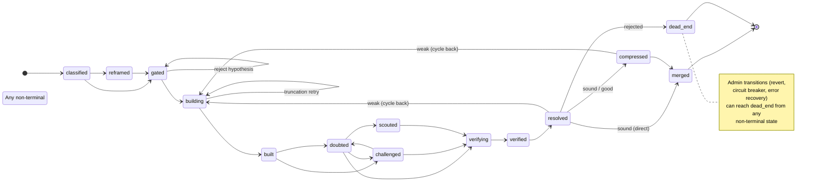

# Majlis

> **When being confidently wrong is more expensive than being slow.**

[](https://www.npmjs.com/package/majlis) [](https://opensource.org/licenses/MIT)

Standard AI coding agents are great at boilerplate, but terrible at novel engineering. They get stuck in loops, hallucinate fixes that break other things, forget context over time, and confidently optimise the wrong objectives.

Majlis wraps Claude Code in a deterministic state machine that forces structured doubt, independent verification, and compressed knowledge. Every hypothesis must survive challenge before merge. Every failure is catalogued as a structural constraint. Every session's learnings are compressed into durable institutional memory.

**This is for:** novel algorithm development, mathematical proof exploration, complex system design where failure modes are unknown, and any problem where being confidently wrong is more expensive than being slow.

Every hard problem is an act of seeking truth in a space no one has mapped. This framework draws from [fifteen traditions](FOUNDATIONS.md) of Islamic scholarship on managing complexity, verifying truth, and making decisions under uncertainty. The methodology is domain-agnostic -- the state machine, evidence hierarchy, and structured doubt cycle apply to any rigorous research, not just code. See [VISION.md](VISION.md) for where this is heading.

## Quick Start

Majlis requires your project to have a deterministic test or metrics command. **Before scaffolding into an existing project**, have Claude read [READINESS.md](READINESS.md) -- it walks through setting up a metrics command, identifying fixtures and gates, writing CLAUDE.md, and configuring tracked metrics.

New project:
```bash
npx create-majlis my-project && cd my-project
majlis status
```

Existing project (after running through READINESS.md):
```bash
npx create-majlis --init
majlis status    # check readiness -- all green?
```

## Workflows

### Semi-Automatic (recommended starting point)

You provide a specific, testable hypothesis. The framework runs the full debate cycle.

```bash
majlis session start "Improving query planner performance"
majlis new "Replace nested loops with indexed lookup for candidate filtering" \
  --sub-type search --context docs/architecture/query-planner.md
majlis next --auto
```

Behind the scenes: a **Gatekeeper** checks the hypothesis against dead-ends, a **Builder** writes code, an **Adversary** constructs pathological inputs, a **Critic** raises doubts, and a **Verifier** grades each component. Then the system resolves deterministically:

- **Sound** -- merge
- **Good** -- merge, record gaps in the fragility map
- **Weak** -- cycle back with synthesised guidance for the builder
- **Rejected** -- dead-end it, record the structural constraint, revert

If the gatekeeper rejects a hypothesis, the experiment pauses at `gated`. Dispute with `majlis next --override-gate` or abandon with `majlis revert`. When you revert, a post-mortem agent analyses the attempt and produces the structural constraint automatically.

Write testable hypotheses -- a single, focused change. "Implement X to achieve Y", not "make it better". Run `majlis compress` when `status` warns you -- context stays manageable across dozens of experiments.

### Manual Step-by-Step

For learning, debugging, or when you want full control over each phase.

```bash
majlis new "hypothesis" --sub-type search
majlis gate           # check hypothesis against dead-ends
majlis build          # builder writes code
majlis doubt          # critic raises concerns
majlis challenge      # adversary constructs failure cases
majlis verify         # verifier grades components
majlis resolve        # route based on grades
```

### Pilot Workflow

For when you're hacking manually in Claude Code but want Majlis to remember what you learned and verify the result.

```bash
majlis session start "exploring axis-relative clustering"
majlis note "axis estimate needs >50 faces to be robust" --tag code-pointer
majlis journal "tried SVD on normals -- stable above 80 faces"
majlis brief --plain          # context dump to paste into Claude Code

# Option A: create a new experiment from your insights
majlis new "axis-relative radius clustering" --skip-gate --from-file hypothesis.md

# Option B: retroactively capture manual work
majlis catch-up "replaced curvature split with radius clustering" --diff HEAD~5..HEAD
```

Notes and journal entries are stored in the DB, injected into builder/verifier agent contexts, and folded into the compressor's synthesis.

### Fully Autonomous

For problems with clear metric targets where you want the framework to explore independently.

```bash
majlis run "Pass all benchmark suites under 200ms p99 latency"
```

The orchestrator plans experiments, creates them, runs full cycles, and creates new experiments when one is dead-ended -- until the goal is met or all approaches are exhausted.

### Parallel Swarm

For problems where diverse approaches should compete.

```bash
majlis swarm "Reduce memory allocation in hot path" --parallel 3
```

Runs N experiments simultaneously in separate git worktrees. Each gets its own branch, DB, and full cycle. The best result is merged; the rest become dead-ends with learnings.

## Core Concepts

### The State Machine

The CLI controls routing, not the LLM. Every experiment moves through a deterministic state machine. Two transition paths enforce this:
- `transition()` -- normal flow, validated against the TRANSITIONS map
- `adminTransition()` -- operational moves (revert, circuit breaker, error recovery)

No agent can skip a step or jump ahead. The state machine is the adab (rules of engagement).


```mermaid
stateDiagram-v2
    direction LR

    [*] --> classified
    classified --> reframed
    classified --> gated
    reframed --> gated

    gated --> building
    gated --> gated : reject hypothesis

    building --> built
    building --> building : truncation retry

    built --> doubted
    built --> challenged

    doubted --> challenged
    doubted --> scouted
    doubted --> verifying
    challenged --> doubted
    challenged --> verifying
    scouted --> verifying

    verifying --> verified
    verified --> resolved

    resolved --> compressed : sound / good
    resolved --> building : weak (cycle back)
    resolved --> merged : sound (direct)
    resolved --> dead_end : rejected

    compressed --> merged
    compressed --> building : weak (cycle back)

    merged --> [*]
    dead_end --> [*]

    state "Any non-terminal" as admin
    note right of dead_end
        Admin transitions (revert,
        circuit breaker, error recovery)
        can reach dead_end from any
        non-terminal state
    end note
```

### The Roles

| Role | Function | Model |
|---|---|---|
| **Builder** | Writes code, runs experiments, tags every decision | opus |
| **Critic** | Challenges with evidence, produces doubt documents | opus |
| **Adversary** | Constructs pathological inputs to break approaches | opus |
| **Verifier** | Dual provenance + content checks, grades components | opus |
| **Reframer** | Independently decomposes from scratch (never sees builder code) | opus |
| **Compressor** | Compresses, cross-references, maintains dead-end registry | opus |
| **Scout** | Searches externally for alternative approaches | opus |
| **Gatekeeper** | Fast hypothesis quality check before building | sonnet |
| **Post-mortem** | Analyses reverted experiments, extracts structural constraints | opus |
| **Diagnostician** | Deep project-wide analysis with full codebase + DB access | opus |
| **Cartographer** | Maps architecture of new codebases during init/scan | opus |
| **Toolsmith** | Verifies toolchain, creates metrics pipeline wrapper | opus |

### The Evidence Hierarchy

Every decision is tagged with its justification level. Stored as database columns, not prompt suggestions.

| Level | Name | Overturn threshold |
|---|---|---|
| 1 | **Proof** | Error found in proof |
| 2 | **Test** | Test shown insufficient |
| 3a | **Strong Consensus** | New contradicting evidence |
| 3b | **Consensus** | Any independent approach contradicts |
| 4 | **Analogy** | Analogy shown structurally false |
| 5 | **Judgment** | Any stronger source contradicts |

## Command Reference

### Essential

```
status [--json]                Show experiment states, cycle position, readiness
new "hypothesis"               Create experiment with branch and DB entry
  --sub-type TYPE              Classify by problem sub-type
  --depends-on SLUG            Block building until dependency is merged
  --context FILE,FILE          Inject domain-specific docs into agent context
  --skip-gate                  Skip gatekeeper (pilot-verified hypothesis)
  --from-file FILE             Inject structured hypothesis from markdown file
next [experiment] [--auto]     Run the next cycle step (or all steps with --auto)
  --override-gate              Proceed past a rejected gate
revert [--reason "..."]        Revert experiment with automatic post-mortem
compress                       Compress institutional memory
session start "intent"         Declare session intent
session end                    Log accomplished/unfinished/fragility
```

### Individual Cycle Steps

Usually handled by `next --auto`. Use these for step-by-step control.

```
gate [experiment]              Spawn gatekeeper agent
build [experiment]             Spawn builder agent
doubt [experiment]             Spawn critic agent
challenge [experiment]         Spawn adversary agent
scout [experiment]             Spawn scout agent
verify [experiment]            Spawn verifier agent
resolve [experiment]           Route based on verification grades
```

### Pilot

For manual hacking with memory. Notes are injected into agent contexts.

```
note "text"                    Save an observation to the DB
  --tag TAG                    Tag (hypothesis, code-pointer, observation, etc.)
  --experiment SLUG            Attach to a specific experiment
journal "text"                 Timestamped breadcrumb during manual work
brief [--plain] [--short]      Context dump for Claude Code sessions
  [--json]                     Output as JSON
catch-up "description"         Create experiment retroactively from manual work
  --diff RANGE                 Git diff range (required, e.g. HEAD~3..HEAD)
  --sub-type TYPE              Classify by problem sub-type
```

### Experiment Control

```
baseline                       Capture metrics snapshot (before build)
measure                        Capture metrics snapshot (after build)
compare [--json]               Compare before/after, detect regressions
classify "domain"              Classify problem space into sub-types
reframe [classification]       Independent decomposition
```

### Orchestration

```
run "goal"                     Autonomous orchestration until goal met
swarm "goal" [--parallel N]    Run N experiments in parallel worktrees
```

### Queries and Diagnostics

```
decisions [--level L]          List decisions by evidence level
dead-ends [--sub-type S]       Dead-ends with structural constraints
fragility                      Show fragility map
history [fixture]              Metric history for a fixture
circuit-breakers               Sub-type failure counts
check-commit                   Exit non-zero if unverified experiments
audit "objective"              Maqasid check -- is the frame right?
diagnose ["focus area"]        Deep diagnosis -- root causes, patterns, gaps
```

### Setup (one-time)

```
init [--scan]                  Initialize Majlis in current project
scan [--force]                 Scan codebase to auto-detect config + write synthesis
resync [--check] [--force]     Update stale synthesis after project evolution
upgrade                        Sync agents, commands, hooks from CLI version
```

## Configuration

`.majlis/config.json`:

```json
{
  "project": {
    "name": "my-project",
    "description": "...",
    "objective": "What are we actually trying to achieve?"
  },
  "metrics": {
    "command": "python scripts/benchmark.py --json",
    "fixtures": {
      "baseline_test": { "gate": true },
      "target_test": {}
    },
    "tracked": {
      "error_rate": { "direction": "lower_is_better" },
      "accuracy": { "direction": "higher_is_better" },
      "value_delta": { "direction": "closer_to_gt", "target": 0 }
    }
  },
  "build": {
    "pre_measure": "make build",
    "post_measure": null
  },
  "cycle": {
    "compression_interval": 5,
    "circuit_breaker_threshold": 3,
    "require_doubt_before_verify": true,
    "require_challenge_before_verify": false,
    "auto_baseline_on_new_experiment": true
  }
}
```

The metrics command must output JSON: `{ "fixtures": { "name": { "metric": value } } }`. Fixtures flagged as `gate` block merge on any regression, regardless of verification grades. The framework lives and dies by `metrics.command` -- it runs automatically before and after every build.

Run `majlis status` to see which config fields are wired up and which need attention.

## Architecture

Three packages in a monorepo:

- `packages/majlis` -- The CLI. Deterministic state machine, SQLite persistence, agent spawning.
- `packages/create-majlis` -- NPX scaffolder that bootstraps Majlis into a project.
- `packages/shared` -- Internal package (`@majlis/shared`). Agent definitions, templates, config defaults, validation. Bundled into both consumer packages via tsup.

```
+---------------------------------------------------------+
|                  LAYER 3: LLM Agents                    |
| builder(opus) . critic(opus) . adversary(opus)          |
| verifier(opus) . reframer(opus) . compressor(opus)      |
| scout(opus) . gatekeeper(sonnet) . postmortem(opus)     |
| diagnostician(opus) . cartographer(opus)                |
| toolsmith(opus)                                         |
|                                                         |
| Creative work. Judgment calls. The scholarship.         |
+---------------------------------------------------------+
|                  LAYER 2: majlis CLI                     |
| State machine . Cycle enforcement . Circuit breakers    |
| Agent spawning . Metric comparison . Regression gates   |
| Experiment dependencies . Scoped context injection      |
|                                                         |
| Deterministic. TypeScript. The adab (rules).            |
+---------------------------------------------------------+
|                  LAYER 1: SQLite + Git                   |
| Experiment state . Evidence tags . Metrics history      |
| Dead-end registry . Fragility map . Session log         |
|                                                         |
| Persistent. Queryable. The institutional memory.        |
+---------------------------------------------------------+
```

## Claude Code Integration

Running `majlis init` or `npx create-majlis --init` installs the following into your project:

### What gets created

```
.majlis/                       Framework internals (git-ignored DB)
  config.json                  Project configuration
  majlis.db                    SQLite database (experiment state, decisions, metrics)
  agents/                      Master agent definitions (source of truth)

.claude/                       Claude Code native integration
  agents/                      Agent definitions (Claude Code discovers these)
  commands/                    Slash commands (/classify, /doubt, /challenge, etc.)
  settings.json                Hooks (merged with existing settings)

docs/                          Structured documentation tree
  synthesis/                   current.md, fragility.md, dead-ends.md
  experiments/                 One doc per experiment (from template)
  classification/              Problem domain taxonomies
  doubts/, challenges/         Agent output artifacts
  verification/, reframes/     Agent output artifacts

CLAUDE.md                      Appended with Majlis Protocol section
```

### CLAUDE.md injection

Majlis appends a `## Majlis Protocol` section to your project's CLAUDE.md. This tells Claude Code about the evidence hierarchy, session discipline, and where to find current state. Your existing CLAUDE.md content is preserved -- the protocol section is appended (or replaced on `majlis upgrade`).

### Hooks

Three hooks are merged into `.claude/settings.json` (your existing hooks are preserved):

- **SessionStart** -- runs `majlis status --json` so Claude Code sees experiment state on launch
- **PreToolUse (Bash)** -- runs `majlis check-commit` before bash commands (safety gate)
- **SubagentStop** -- reminds you to run `majlis next` when an agent finishes

### Slash commands

10 commands installed in `.claude/commands/`: `/classify`, `/doubt`, `/challenge`, `/verify`, `/reframe`, `/compress`, `/scout`, `/audit`, `/diagnose`, `/scan`. These let you trigger cycle steps directly from Claude Code without switching terminals.

### Upgrading

`majlis upgrade` syncs agent definitions, slash commands, and hooks to the latest CLI version. It replaces the `## Majlis Protocol` section in CLAUDE.md but preserves your config, database, synthesis docs, and any other CLAUDE.md content.

## License

MIT
